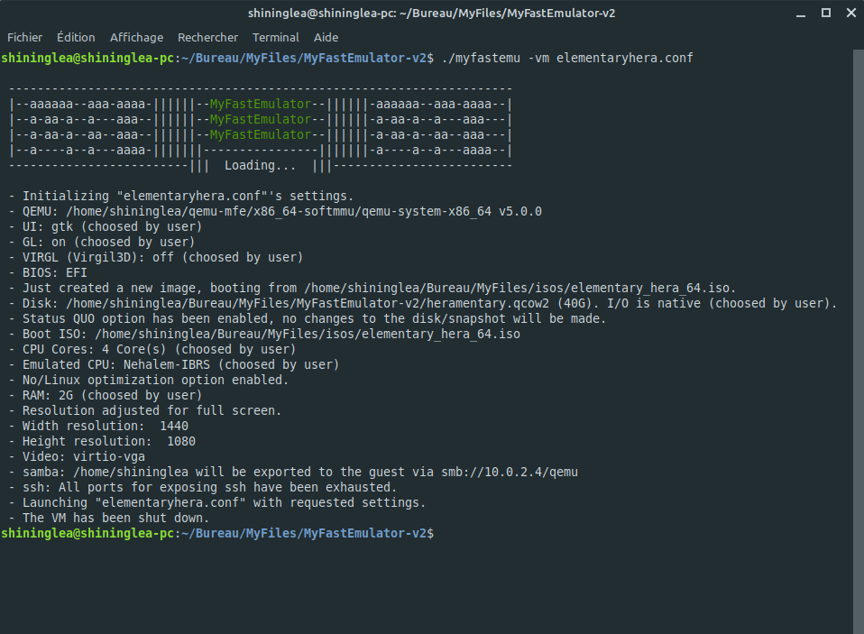

<h1 align="center">
  
  <br />
  MyFastEmulator v2
</h1>

<p align="center"><b>Frontend for QEMU, with nice features.</b></p>
<div align="center"></div>
<p align="center">Made with 💝 for </p>

## Introduction

MyFastEmulator v2 is a fork of MyFastEmulator which is itself a fork of the <a href="https://github.com/wimpysworld/quickemu">Quickemu</a> project which aims to be built off of the latest QEMU version built with other nice features, such as Virgil3D, OpenGL, KVM support, and more. But overall, it allows you to easily manage your QEMU virtual machines without any hassle. Each
virtual machine configuration is requiring minimal but very useful configuration, such as total CPU cores, emulated cpu, RAM, and even more. The
main objective of the project is to enable quick testing of desktop Linux
distributions AND Windows operating systems where the virtual machines can be stored anywhere, such as
external USB storage.

MyFastEmulator v2 is faster than its competitors, for a few reasons. First, it uses emulation rather than pure virtualization. This allows, for example, to use a CPU NOT matching the host one. This also allows better VM performance and less CPU usage since it won't directly use the host CPU. Second, it's very minimal compared to virt-manager, for example. It requires very minimal configuration and doesn't have too much features. And lastly, because it uses KVM as the main accelerator. VMware just can't use KVM, while VirtualBox "sort of can" use it as an option (however, KVM on Windows isn't real KVM as we all know). virt-manager, on the other hand, uses KVM. But it's not as fast as MyFastEmulator v2. See the video
where wimpysworld explains some of his motivations for creating the original script :

[](https://www.youtube.com/watch?v=AOTYWEgw0hI)

## Installation

Clone this repository :

```
git clone --single-branch --branch=mfe-v2 https://github.com/AnErrupTion/MyFastEmulator.git
```

Compile and "install" QEMU v5.0. Instructions on how to do these can be found in the `compile_qemu.txt` file.

## Usage

## FOR LINUX DISTROS

  * Download an ISO image of a Linux distribution
  * Create a VM configuration file, for example `your_configuration_file.conf`

```
iso="focal-desktop-amd64.iso"
disk_img="focal-desktop-amd64.qcow2
disk=60G
```
(These are only a few options of MyFastEmulator v2. To see the full list of options, see the `example.conf` file.</a>.)

  * Use `myfastemu` to start the virtual machine:

```
./myfastemu -vm your_configuration_file.conf
```

  * A Desktop shortcut can be created (in ~/.local/share/applications):
```
./myfastemu -vm your_configuration_file.conf -shortcut
```

  * NOTE : If you have an error where it cannot find the virtual HDD or that you haven't specified an ISO image (with desktop shortcut, at the startup of the VM) then you need to **add the full path of the virtual HDD AND ISO in the configuration file**.

Which will output something like this:

<div align="center"></div>

Here are the full usage instructions:

```
Usage
  ./myfastemu -vm your_configuration_file.conf

You can also pass optional parameters
  --delete                : Delete the desktop shortcut.
  --shortcut              : Create a desktop shortcut.
  --snapshot apply <tag>  : Apply/restore a snapshot.
  --snapshot create <tag> : Create a snapshot.
  --snapshot delete <tag> : Delete a snapshot.
  --snapshot info         : Show disk/snapshot info.
```

## TODO

  - [x] Make display configuration more robust
  - [x] Improve stdout presentation
  - [x] Make disk image size configurable
  - [x] Improve snapshot management
  - [x] Add option to create a desktop launcher (shortcut) for a VM (https://github.com/wimpysworld/quickemu/pull/18)
  - [x] Add support for Virgil3D
  - [x] Add support for GL
  - [x] Get QEMU `-audiodev` working for audio input
  - [x] Add Windows support
  - [x] Improve performance
  - [x] Add USB pass-through support
  - [ ] Add a version system
  - [ ] Add NVMe support
